# Java Web

## Java基础

1. 面向对象：根据事物的特征和行为抽象出类(具有属性和方法)，而具体的事物则是对象（类的实例）

2. 抽象与封装

   从一群事物中抽取共同的特征和行为，然后把这些特征和行为封装到一起作为类

3. 访问控制修饰符

   + public（公开的）：任何类都可以访问

   + protected(受保护)：同包的类或子类才可访问

     + 基类的 protected 成员是包内可见的，并且对子类可见
     + 若子类与基类不在同一包中，那么在子类中，子类实例可以访问其从基类继承而来的protected方法，而不能访问基类实例的protected方法

   + 不写(默认)：同包的类才可以访问

   + private （私有）:当前类才可以访问(同文件都不可以)

     | 修饰符    | 当前类 | 同一包内 | 子孙类 （同包） | 子孙类（不同包） |
     | --------- | ------ | -------- | --------------- | ---------------- |
     | public    | Y      | Y        | Y               | Y                |
     | protected | Y      | Y        | Y               | Y/N              |
     | default   | Y      | Y        | Y               | N                |
     | private   | Y      | N        | N               | N                |

     类和接口不能声明为 **private**。

     声明为**private**访问类型的变量只能通过类中公共的 getter 方法被外部类访问

4. 接口

   + 接口里的变量都隐式声明为 **public static final**,而接口里的方法默认情况下访问权限为 **public**。

5. 继承

   + 父类中声明为 public 的方法在子类中也必须为 public
   + 父类中声明为 protected 的方法在子类中要么声明为 protected，要么声明为 public，不能声明为 private
   + 父类中声明为 private 的方法，不能够被继承

6. 基本数据类型

   | 数据类型 | 长度 | 默认值  |
   | -------- | ---- | ------- |
   | byte     | 1    | 0       |
   | short    | 2    | 0       |
   | int      | 4    | 0       |
   | long     | 8    | 0L      |
   | float    | 4    | 0.0f    |
   | double   | 8    | 0.0d    |
   | char     | 2    | 'u0000' |
   | String   |      | null    |
   | boolean  | 1    | false   |

   + 自动类型转换：byte,short,char—> int —> long—> float —> double 

## C/S与B/S

1. C/S——Client Server

   + 优点：美观、功能强大

   + 不足：每一台客户端都需要安装客户端软件、如果软件升级，那么全部软件都需要升级、维护麻烦(需要维护每一台客户端软件)

2. B/S——Broswer Server

   + 客户端可以通过浏览器直接访问服务端
   
3. 区别

## Tomcat

1. 目录

+ bin：可执行文件（开启startup.bat、关闭shutdown.bat）

+ conf：配置文件（server.xml）

+ lib：tomcat依赖的jar文件

+ log：日志文件（记录出错等信息）

+ temp：临时文件

+ webapps：可执行的web项目目录（web项目基本结构：WEB-INF(classes、lib、web.xml)）

+ work：存放由jsp翻译成的java，以及编辑成的class文件(jsp  ->java ->class)

+ 默认端口：8080（localhost:8080默认访问webapps/ROOT ）

   在项目/WEB-INF/web.xml中设置 默认的初始页面   

  ```
  <welcome-file-list>
  		<welcome-file>index.jsp</welcome-file>
  </welcome-file-list>
  ```

2. 配置虚拟路径（默认为webapps）
    将web项目配置到 webapps以外的目录
    conf/server.xml中配置
    host标签中：

    ```
    <Context  docBase="D:\study\JspProject"  path="/JspProject"   />
    
    docBase：实际路径 
    path：虚拟路径  （绝对路径、相对路径【相对于webapps】）
      访问虚拟路径实际上是访问实际路径
    ```

 3. 配置虚拟主机

    通过自定义url:www.test.com访问本机
     conf/server.xml

    ``` 
    <Engine name="Catalina" defaultHost="www.test.com">	//将defaulthoset改为自定义url
    <Host appBase="D:\study\JspProject" name="www.test.com">
    			<Context docBase="D:\study\JspProject"   path="/"/> 	//配置虚拟路径
    </Host>
    ```

##  JSP

+ 执行流程：jsp→java(Servlet文件) →class

  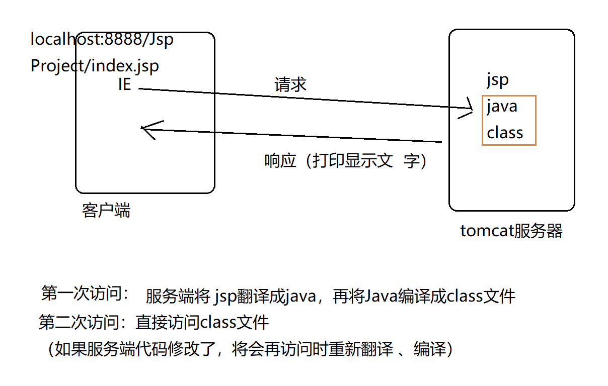
  
+ JSP和Servlet 可以相互转换，由于第一请求服务端 会有翻译和编译的过程，因此会比较慢，不过后续访问可以直接访问class，因此速度较快。但是如果服务端修改了代码，则再次访问时会重新的翻译、编译。

+ 注释
  
   ```
   html注释：<!-- -->   可见（客户端通过浏览器查看源码）
   java注释：//     /*...*/         不可见
   jsp注释：<%-- --%>        不可见
   ```
## GET/POST

+ 区别：
  1. get方式 在地址栏显示请求信息  (但是地址栏能够容纳的 信息有限，4-5KB；如果请求数据存在大文件，图片等  会出现地址栏无法容纳全部的数据而出错) ；post不会显示
  
  2. 文件上传操作，必须是post
  
## Forward /Redirect

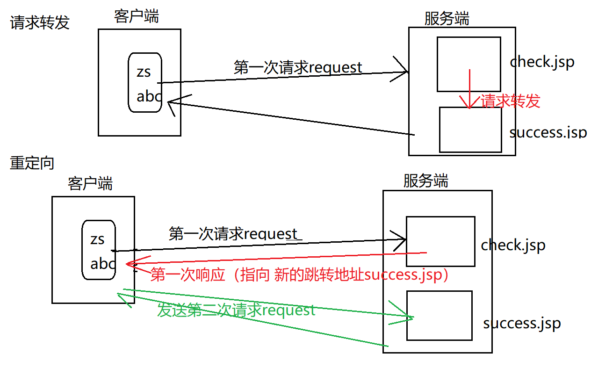

   + ###### 区别：

|                            | 请求转发   | 重定向               |
| -------------------------- | ---------- | -------------------- |
| 地址栏是否改变             | 不变       | 改变                 |
| 是否保留第一次请求时的数据 | 保留       | 不保留               |
| 请求的次数                 | 1          | 2                    |
| 跳转发生的位置             | 服务端内部 | 客户端发起第二次请求 |

+ example：

  + 请求转发 (内部转发，对于客户端是透明)

    > 张三（客户端）→【服务窗口 A （服务端 ）→ 服务窗口B 】

  + 重定向

    > 张三（客户端）→服务窗口 A （服务端 ）→去找B
    >
    > 张三（客户端）→服务窗口 B （服务端 ）→结束

## Cookie/Session

#### Cookie

+ 存放于客户端、同一个浏览器，同一个路径下cookie可以共享、key-value、javax.servlet.http.Cookie

1. cookie是由服务端生成的，再发送给客户端保存（提高访问服务端的效率，但是安全性较差）相当于本地缓存的作用： 客户端(hello.mp4,zs/abc)→服务端(hello.mp4；zs/abc)

2. 服务端准备cookie：response.addCookie(Cookie cookie)，通过页面跳转（转发，重定向）发给客户端
    客户端获取所有cookies:  request.getCookies()，cookies默认包含有一个JSESSIONID的cookie

  > 服务端添加cookie：response对象；客户端获取对象：request对象
  > 不能直接获取某一个单独cookie对象，只能一次性将全部的cookie拿到
  > 服务端在第一次响应客户端默认会产生一个包含JSSSIONID的cookie(即使服务端没有设置其他cookie)
#### Session

+ 存放于服务端，不同浏览器不共享session,同一浏览器共享session）


1. 机制（第一次客户请求时 产生一个sessionid 并复制给 cookie的jsessionid 然后发给客户端，最终实现session的sessionid与cookie的jsessionid一一对应）

   + 客户端第一次请求服务端时,服务端发现该客户没有session，于是产生一个session对象（用于保存该客户的信息)；并且每个session对象都会有一个唯一的 sessionId( 用于区分其他session)；接着产生一个cookie（该cookie的name=JSESSIONID ,value=服务端sessionId）服务端会在响应客户端的同时将该cookie发送给客户端，客户端接收响应之后就有了 一个cookie(JSESSIONID)因此，客户端的cookie就可以和服务端的session一一对应（JSESSIONID - sessionID）
    +  客户端第二/n次请求服务端时:服务端会根据客户端发送过来的cookie中的JSESSIONID去服务端的session中匹配sessionid，如果匹配成功（cookie  jsessionid=sesion sessionid），说明此用户不是第一次访问,无需登录；

####    区别

|            | session | cookie   |
| ---------- | ------- | -------- |
| 保存的位置 | 服务端  | 客户端   |
| 安全性     | 较安全  | 较不安全 |
| 保存的内容 | Object  | String   |

+ 使用request登录后
 > 刷新：重新提交表单（包含表单数据），登录成功
 > 回车：重新发起新请求，直接跳转界面（表单无数据），登录失败

四种范围对象（小→大）
 > + page：当前页面有效 (页面跳转后无效)
 > + request： 同一次请求有效；其他请求无效 （请求转发后有效；重定向后无效）
 > + session： 同一次会话有效  （无论怎么跳转，都有效；关闭/切换浏览器后无效 ； 从登陆->退出之间全部有效）
 > + application：全局变量；整个项目运行期间都有效 (切换浏览器 仍然有效)；关闭服务、其他项目无效
 > 以上的4个范围对象，通过 setAttribute()赋值，通过getAttribute()取值；尽量使用最小的范围。因为对象的范围越大，造成的性能损耗越大。


## JDBC(Java DataBase Connectivity)

+ JDBC可以为多种关系型数据库DBMS提供统一的访问方式，用Java来操作数据库

  ``` 
  1.jdbc总结（模板、八股文）：
  
  try{
  1.导入驱动包、加载具体驱动类Class.forName("具体驱动类");
  2.与数据库建立连接connection = DriverManager.getConnection(...);
  3.通过connection，获取操作数据库的对象（Statement\preparedStatement\callablestatement）
  stmt = connection.createStatement();
  4.(查询)处理结果集rs = pstmt.executeQuery()
  while(rs.next()){ rs.getXxx(..) ;}
  }catch(ClassNotFoundException e  )
  { ...}
  catch(SQLException e)
  {...
  }
  catch(Exception e)
  {...
  }
  finally
  {
  	//打开顺序，与关闭顺序相反
  	if(rs!=null)rs.close()
  	if(stmt!=null) stmt.close();
  	if(connection!=null)connection.close();
  }
  
  jdbc中，除了Class.forName() 抛出ClassNotFoundException，其余方法全部抛SQLException `
  ```


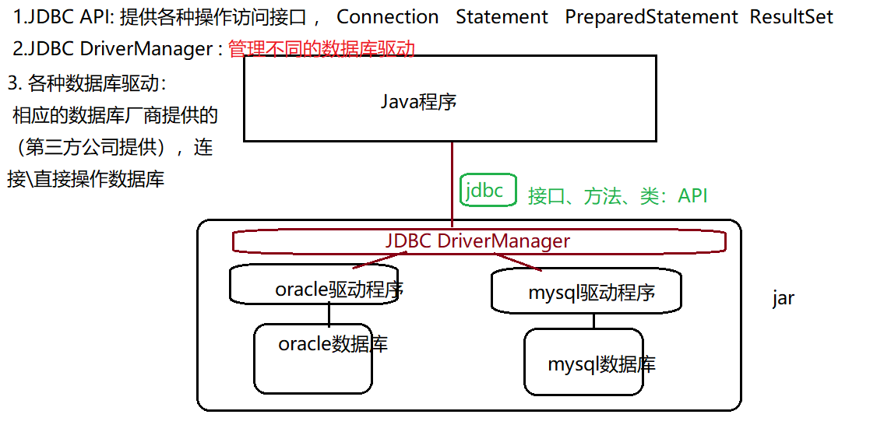

+ JDBC API

  > DriverManager ： 管理jdbc驱动
  > Connection： 连接（DriverManager产生）
  > Statement：（PreparedStatement） ：增删改查  （Connection产生 ）
  > ResultSet：返回的结果集  （Statement产生 ）
  > CallableStatement： 调用数据库中的 存储过程/存储函数  （通过Connection产生 ）
  
  
  
  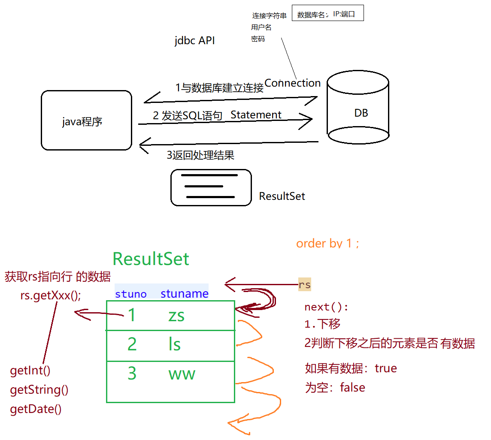

+ 推荐使用PreparedStatement

  > 编码更加简便（避免了字符串的拼接）
  >
  > 提高性能(因为有预编译操作，预编译只需要执行一次)
  >
  > 安全（可以有效防止sql注入）
  >
  > + 当需要数据库进行数据插入、更新或者删除的时候，程序给发送整个sql语句给数据库处理和执行。数据库处理一条sql语句，需要完成对sql语句的解析、检查语法以及生成代码；一般来说，处理时间要比执行sql的时间长。预编译语句在创建的时候就已经将sql语句发送给了DBMS，完成了解析、检查语法以及生成代码的过程。因此，当一个sql语句需要执行多次时，使用预编译语句可以减少处理时间，提高执行效率。 

+ 数据库驱动

  |           | 驱动jar                    | 具体驱动类                                   | 连接字符串                                                   |
  | --------- | :------------------------- | -------------------------------------------- | ------------------------------------------------------------ |
  | Oracle    | ojdbc-x.jar                | oracle.jdbc.OracleDriver                     | jdbc:oracle:thin:@localhost:1521:ORCL                        |
  | MySQL     | mysql-connector-java-x.jar | com.mysql.jdbc.Driver                        | jdbc:mysql://localhost:3306/数据库实例名                     |
  | SqlServer | sqljdbc-x.jar              | com.microsoft.sqlserver.jdbc.SQLServerDriver | jdbc:microsoft:sqlserver:localhost:1433;databasename=数据库实例名 |

  
  ​									

## JavaBean

+ 定义
  1. public 修饰的类，提供一个默认的无参构造函数无参构造
  2. 所有属性(如果有) 都是private，并且提供set/get   (如果boolean 则get 可以替换成is)
  3. 需要被序列化并且实现了 Serializable 接口
  
+ 使用层面
 1. 逻辑：封装业务逻辑的JavaBean  (LoginDao.java封装了登录逻辑)
  2. 数据 ：封装数据的JavaBean（实体类，Student.java  Person.java）
     + 封装业务逻辑的JavaBean用于操作一个封装数据的JavaBean    
+ 作用：简化 代码(jsp->jsp+java)、提供代码复用(LoginDao.java)

  
 ## MVC

+ 目标：解耦合、提高代码复用
  + M-Model模型：一个功能。用JavaBean实现。
  + V-View视图： 用于展示、以及与用户交互。使用html、js、css、jsp、jquery等前端技术实现
  + C-Controller控制器：接受请求，将请求跳转到模型进行处理；模型处理完毕后，再将处理的结果返回给请求处，一般使用 Servlet实现控制器。

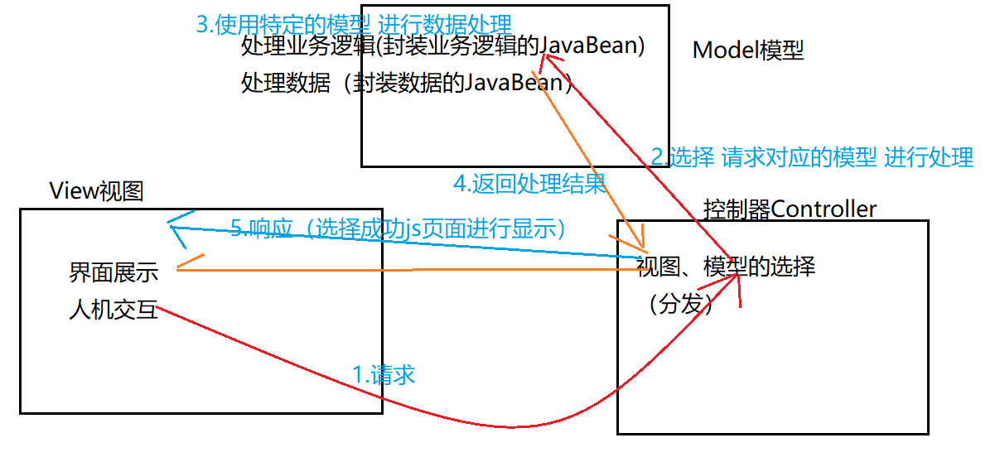

---

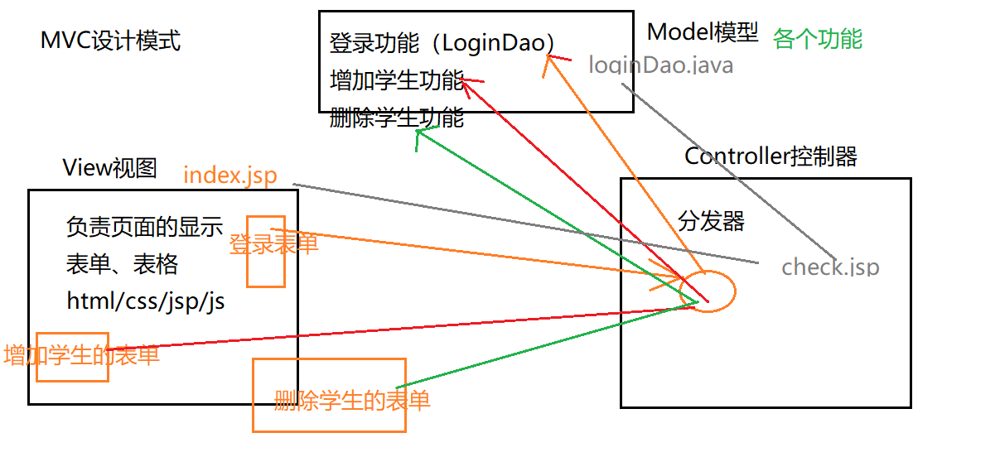


## Servlet

+ 定义（ javax.servlet.http.HttpServlet）

  Java Servlet 是运行在 Web 服务器或应用服务器上的程序，它是作为来自 Web 浏览器或其他 HTTP 客户端的请求和 HTTP 服务器上的数据库或应用程序之间的中间层。

  ```
  doGet()： 接受并处理所有get提交方式的请求
  doPost()：接受并处理所有post提交方式的请求
  ```

+ 请求处理流程：请求会被<servlet-mapping>中的<url-pattern>拦截，根据<servlet-name> 去<servlet>中寻找对应的<servlet-class>，将请求交由相应的Servlet执行。

  web.xml：
  ```
  <servlet>
    <servlet-name>WelcomeServlet</servlet-name>
    <servlet-class>org.lanqiao.servlet.WelcomeServlet</servlet-class>
  </servlet>
    
  <servlet-mapping>
    	<servlet-name>WelcomeServlet</servlet-name>
    	<url-pattern>/WelcomeServlet</url-pattern>	//拦截请求
  </servlet-mapping>
  ```

  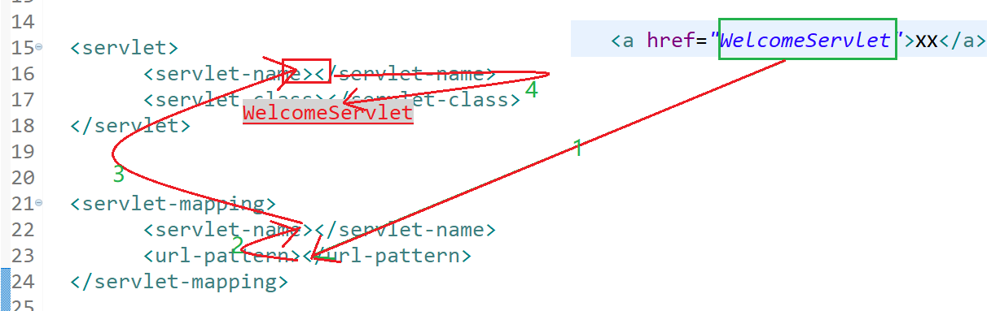


+ 生命周期(5阶段)：加载→初始化（ init() 该方法会在 Servlet被加载并实例化的以后执行，只执行这一次）→服务（service()---doGet、doPost）→销毁 （destroy()， Servlet被系统回收时执行，执行一次）→卸载
  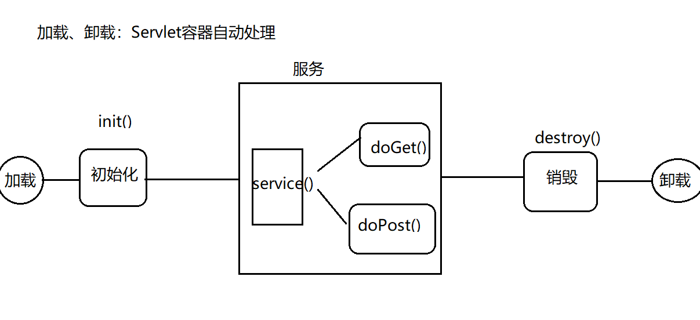

+ 设置Tomcat启动时自动启动Servlet

  + Servlet2.5： web.xml

    ```
    <servlet>
    				...
      				 <load-on-startup>1</load-on-startup>
    </servlet>	
    其中的“1”代表第一个。
    ```

  + Servlet3.0
    @WebServlet( value="/WelcomeServlet" ,loadOnStartup=1)

+ 继承关系

  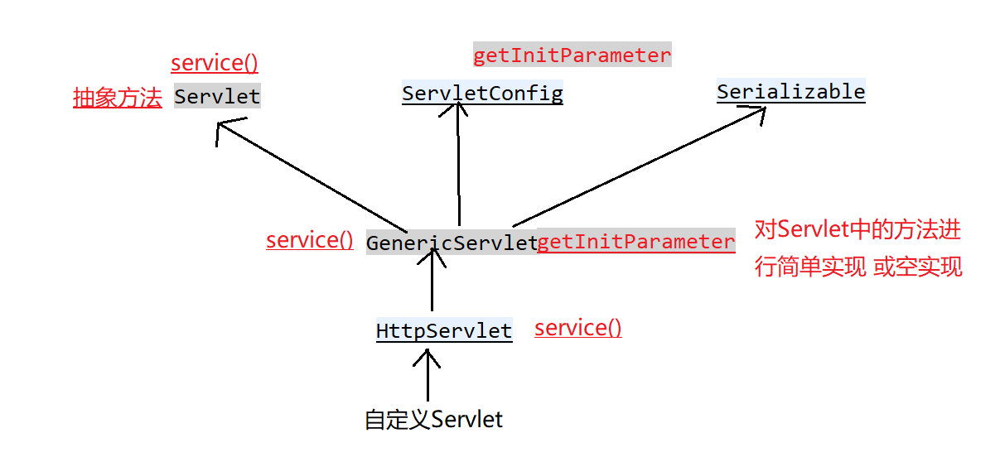

  +  Servlet API 由两个软件包组成：对应于HTTP协议的软件包、对应于除了HTTP协议以外的其他软件包（Servlet  API可以适用于任何通信协议） 
  + HttpServlet中重写servie（将父类中的ServletRequest/Response强转为HttpServletRequest/Response）

## 三层架构

+ 组成

  + 表示层（USL, User Show Layer—视图层）

    + 前台：对应MVC中的View，用于用户交互、界面显示（jsp、js、html、jquery等前端技术）
    + 后台：对应于MVC中的Controller，用于处理请求、页面跳转、调用业务逻辑层（Servlet(SpringMVC、Struts2)）

  + 业务逻辑层（BLL, Business Logic Layer—Service层）

    + 接收表示层的请求调用
    + 组装数据访问层、逻辑性的操作

  + 数据访问层（DAL, Data Access Layer—Dao层）

    + 直接访问数据库的操作，原子性操作（CURD）

    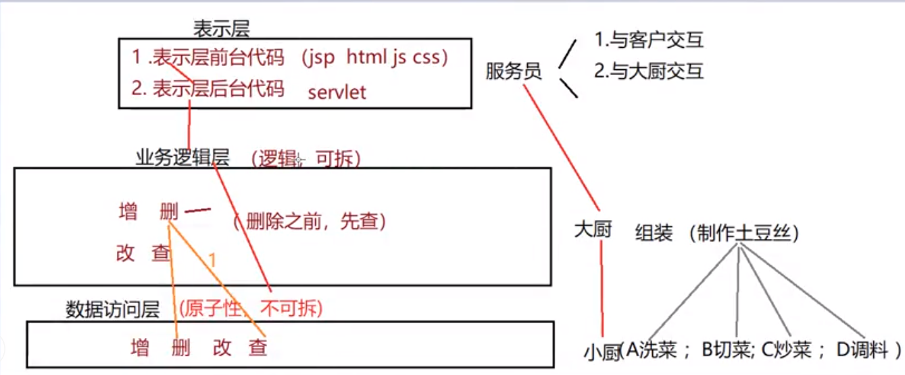

    ---

    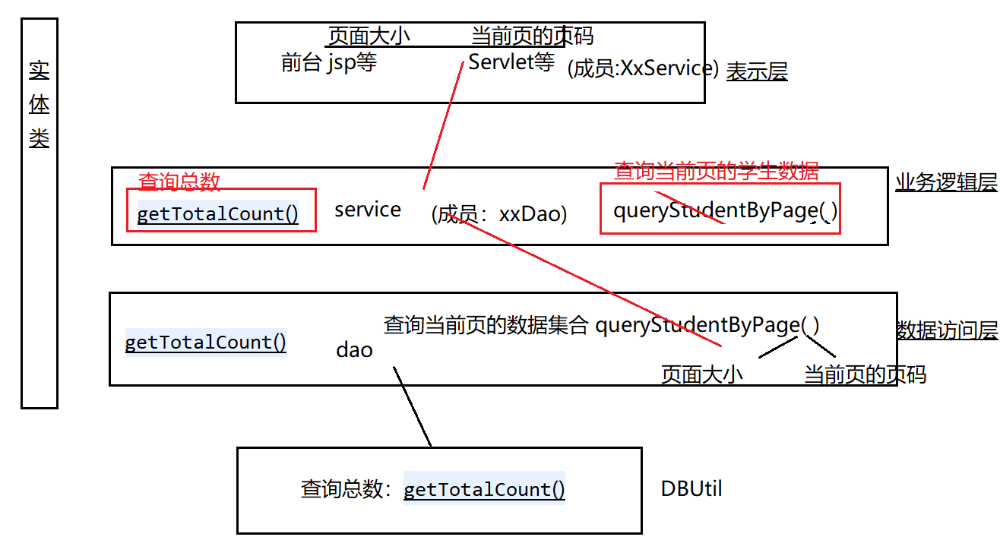

+ 三层关系：上层依赖于下层，上层调用下层

+ MVC与三层对应关系

  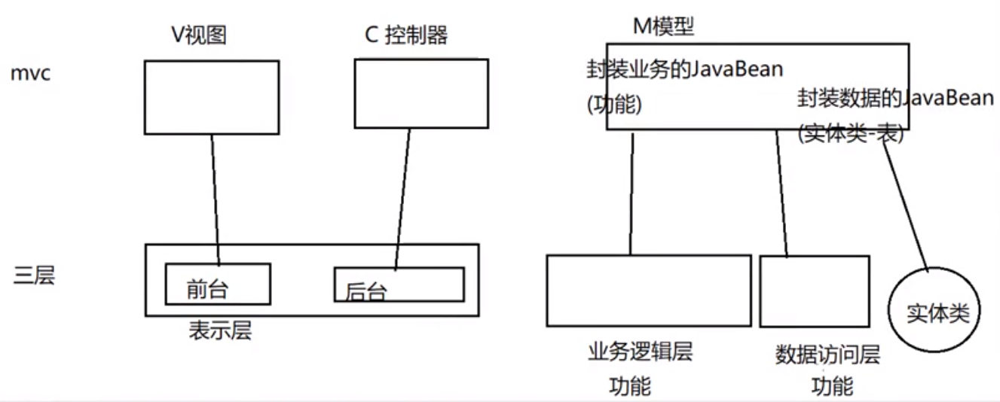

## 分页

要实现分页，必须知道某一页的数据从哪里开始到哪里结束

mysql分页：从0开始计数

| 页面 | 开始 |    结束    |
| :--: | :--: | :--------: |
|  0   |  0   |     9      |
|  1   |  10  |     19     |
|  2   |  20  |     29     |
|  n   | n*10 | (n+1)*10-1 |

```
select * from student limit 页数*页面大小,页面大小
```

+ 实现

  + 数据总数：查数据库,select count(*)..

  + 页面大小（每页显示的数据条数）：用户自定义

  + 总页数 = 数据总数/页面大小（向上取整）：程序自动计算

    ```
    总页数 = 数据总数%页面大小==0? 数据总数/页面大小:数据总数/页面大小+1
    ```

  + 当前页（页码）：用户自定义

  + 当前页的对象集合（实体类集合）：查数据库,分页sql

+ 查询流程

  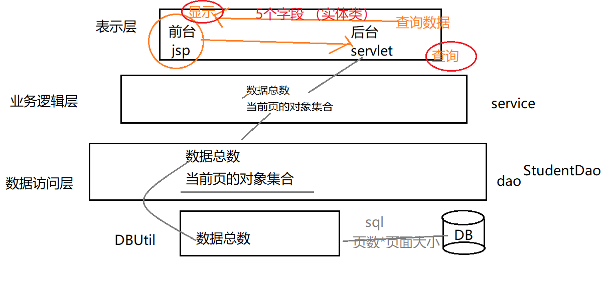

## 过滤器

+ 实现一个Filter接口，init()、destroy() 原理、执行时机同Servlet，

  ```
  //要想将一个普通的class编程一个具有特定功能的类（过滤器、拦截....），要么继承父类、要么实现一个接口、要么增加一个注解
  public class MyFilter implements Filter {//过滤器
  	@Override
  	public void init(...) {
  		System.out.println("filter..init..");
  	}
  	@Override
  	public void doFilter(...){
  	
  	}
  	@Override
  	public void destroy() {
  		System.out.println("filter..destroy..");
  	}
  }
  ```

+ 配置过滤器（类似servlet）

  ```
  <filter>
    	<filter-name>MyServlet</filter-name>
    	<filter-class>org.student.filter.MyFilter</filter-class>
  </filter>
  
  <filter-mapping>
  	<filter-name>MyFilter2</filter-name>
  	<url-pattern>/*</url-pattern>
  </filter-mapping>
  
  
  //拦截一切请求（每一次访问 都会被拦截）
  <url-pattern>/*</url-pattern>
  
  
  /*dispatcher请求方式：
   	REQUEST：拦截HTTP请求get post
   	FORWARD：只拦截通过请求转发方式的请求
   	INCLUDE:只拦截拦截通过request.getRequestDispatcher("").include() 、通过<jsp:include page="..." />此种方式发出的请求
   	ERROR：只拦截<error-page>发出的请求
  */
  
  <filter-mapping>
    	<filter-name>MyServlet</filter-name>
    	<url-pattern>/*</url-pattern>
    	<dispatcher>REQUEST</dispatcher>
    	<dispatcher>FORWARD</dispatcher>
    </filter-mapping>
  ```

+ 通过doFilter()处理拦截，并且通过chain.doFilter(request, response)放行

  ```
  public class MyFilter implements Filter {
  	public void doFilter(...){
  		System.out.println("拦截请求......");
  		chain.doFilter(request, response);//放行
  		System.out.println("拦截响应......");	
  	}
  }
  ```

+ 过滤器链：可以配置多个过滤器，过滤器的先后顺序是由 <filter-mapping>的位置 决定


## Ajax(异步js与xml)

+ 实现方式
  + js：XMLHttpRequest
  + jquery：

回调函数：如果a()是b()的回调函数，那么b()执行完后会执行a()

## 反射

1. 机制：在运行状态中，对于任意一个类，都能够知道这个类的所有属性和方法，都能调用它的任意一个方法和属性

2. 功能
   + 在运行时判断任意一个类所具有的成员变量和方法
   + 在运行时判断任意一个对象所属的类
   + 在运行时构造任意一个类的对象
   + 在运行时调用任意一个对象的方法
   + 生成动态代理
   
3. 获取Class对象的三种方式（在运行期间，一个类只有一个Class对象产生。）

   +  Object→getClass();

     ```
     Student stu1 = new Student();//这一new 产生一个Student对象，一个Class对象。
     Class stuClass = stu1.getClass();//获取Class对象
     ```

   + 任何数据类型（包括基本数据类型）都有一个“静态”的class属性

     ```
     Class stuClass2 = Student.class;
     ```

   + 通过Class类的静态方法：forName（String  className）(常用)

     ```
     try {
     	Class stuClass3 = Class.forName("com.entity.Student");//全类名：包名+类名
     } catch (ClassNotFoundException e) {
     	e.printStackTrace();
     }
     ```

4. 通过class对象获取方法

   + 获取所有公共方法（包括当前类、父类、接口中的所有public方法）

     ```
     Method[] methods = perClazz.getMethods();
     for (Method method:methods) {
     	System.out.println(method);
}
     ```
     
   + 获取**当前类**的所有方法（忽略访问修饰限制，包括public、private）
   
     ```
     Method[] declaredMethods = perClazz.getDeclaredMethods();
     for (Method declme:declaredMethods) {
     	System.out.println(declme);
     }
     ```
   
   + 获取**当前类**的所有接口类
   
     ```
     Class[] interfaces = perClazz.getInterfaces();
     for (Class inter:interfaces) {
          System.out.println(inter);
     }
     ```
   
   + 获取父类
   
     ```
     Class superclass = perClazz.getSuperclass();
     ```
   
   +  获取所有的公共属性（包括当前类、父类public属性）
   
     ```
     Field[] fields = perClazz.getFields();
     for (Field field:fields){
     	System.out.println(field);
     }
     ```
   
   + 获取**当前类**的所有属性（包括public、private）
   
     ```
     Field[] fields2 = perClazz.getDeclaredFields();
     for (Field declefield:fields2) {
     	System.out.println(declefield);
     }
     ```
   
   + 获取**当前类**的公共构造方法
   
     ```
     Constructor[] publicConstructor=perClazz.getConstructors();
     for (Constructor contr:publicConstructor) {
     	System.out.println(contr);
     }
     ```
   
   + 获取**当前类**的所有构造方法（包括private）
   
     ```
     Constructor[] allConstructor=perClazz.getDeclaredConstructors();
     for (Constructor contr:allConstructor) {
     	System.out.println(contr);
     }
     ```
   
   + 获取**当前类**指定构造方法（根据参数类型）
   
     ```
     /*
     public Person(String name){
             this.name = name;
        }
     */
     Constructor constructor1 = perClazz.getConstructor(String.class);
     ```
   
   + 创建对象（实例）
   
     ```
     //获取当前反射所代表类（接口）的对象（实例）
     Object perInstan = perClazz.newInstance();
     Person per = (Person)perInstan;
     
     //构造方法创建实例(传参)
     Person per = (Person)constructor1.newInstance("Li");
     ```
   
   + 通过反射操作成员属性、成员方法
   
     ```
     Person person = (Person)perClazz.newInstance();
     /*
     访问的是private修饰的属性和方法，无法直接访问
     需要开启访问权限Field/Method.setAccessible(true)
     */
     Field nameField =perClazz.getDeclaredField("name");
     nameField.setAccessible(true);    
     nameField.set(person,"Lin");	//设置属性
     
     Method method=perClazz.getDeclaredMethod("search",null);
     method.setAccessible(true);
     method.invoke(person,null);//   方法调用invoke
     ```
   
5. 应用

   + 越过泛型检查

     ```
     ArrayList<Integer> list = new ArrayList<>();
     Class listClazz = list.getClass();
     //修改add方法参数类型
     Method method = listClazz.getMethod("add",Object.class);
     method.invoke(list,'abc')
     ```

   + 万能set方法(给任意对象任意属性赋值)

     ```
     public void setProperty(Object obj, String propertyName, Object value){
     	Class clazz = obj.getClass();
     	Field field = clazz.getDeclaredField(propertyName);
     	field.setAccessible(true);
     	field.set(obj,value);
     }
     ```

     

## RPC（Remote Procedure Call）

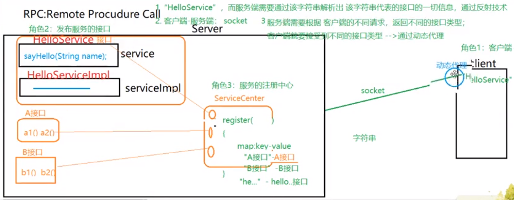

+ 首先开启服务端，等待客户端调用。客户端会通过Proxy.newProxyInstance（）生成代理对象Service service，当客户端调用service.getInfo()时，会调用代理对象中的invoke方法：向服务端发起请求，服务端接收请求后调用服务端的getInfo方法，并将结果返回给客户端。
  

## Socket


## 多线程（multithreading）

+ 概念：线程是进程的基本单位，一个进程可同时存在多个线程。线程是进程中实施调度和分派的基本单位，一个进程可以有多个线程，但至少有一个线程；而一个线程只能在一个进程的地址空间内活动。内存资源分配给进程，同一个进程的所有线程共享该进程所有资源。而CPU分配给线程，即真正在处理器运行的是线程。

  当我们执行java程序时，会开启一个java.exe进程，此进程会创建第一个线程，称为主线程，主线程去执行main方法，可以通过Thread t=Thread.currentThread();获取代码当前执行的线程（java代码总是在某个线程中执行的）

+ 创建线程

  + 继承Thread，重写run方法(run方法中编写任务执行代码)

    Thread extends Object implements Runnable

    ```
    public Task extends Thread{
    	public void run(){
    		...
    	}
    }
    ```

  + 编写一个类实现Runnable接口，重写run方法,创建其对象，传递给Thread构造器

+ 线程通信

  + 在java中多个线程间通过共享变量（成员变量/静态变量）进行通信

+ 线程安全问题

  当多个线程操作同一共享数据时，引发的一种不正常的结果。count++的指令在实际执行的过程中不是原子性的，而是要分为读、改、写三步来进行；即先从内存中读出count的值，然后执行+1操作，再将结果写回内存中

  + 原子性：一个或者多个操作在 CPU 执行的过程中被中断
  + 可见性：一个线程对共享变量的修改，另外一个线程不能立刻看到
  + 有序性：程序执行的顺序没有按照代码的先后顺序执行
  
+ 如何解决线程安全问题

  + 同步(synchronized)(解决线程交错和内存不一致问题) 

    + 修饰成员方法时:以当前对象为锁（修饰方法与修饰代码块的效果一致）

      ```
      public synchronized void fun(){
      
      }
      
      
      public void fun(){
      	synchronized(this){
      	
      	}
      }
      ```

     + 修饰静态方法时:以类对象为锁

       ```
         public synchronized static void fun(){
         
         }
         
         //假设当前类为Test
         public static void fun(){
         	synchronized(Test.class){
         	
         	} 
         }
       ```

    + 代码块(同步代码块)

      任何对象都可以作为锁

  

## Extra

#### 空实现类

+ 目的：为了解决实现接口中的某个方法同时必须实现其不需要的方法他的方法（空实现）的问题

1. 定义接口

   ```
   package org.lanqiao.servlet;
   
   public interface Student {
   	void sleep();
   	void study();
   }
   ```

2. 给接口设计空实现类

   ```
   package org.lanqiao.servlet;
   
   public class StudentImpl implements Student {
   	@Override
   	public void sleep() {
   	}
   
   	@Override
   	public void study() {
   	}
   }
   ```

3. 继承这个空实现类

   ```
   package org.lanqiao.servlet;
   
   public class Text extends StudentImpl {
   	@Override
   	public void study() {
   		System.out.println("只要重写需要用到的方法。。。。。");
   	}
   }
   ```

#### equals

+ a.equals("true");和"null".equals(a);有什么区别的？

  >  前者会抛空指针异常，后者不会；如果a=null，String对象就会是一个空对象，空对象说明没有equals方法，所以就会报空指针异常；若后者a=null，"null".equals(a);结果永远都为false，

#### 物理分页与逻辑分页

1. 概述
   + 物理分页：依赖于某一物理实体（即数据库），数据库本身提供的分页方式。比如MySQL数据库提供了limit关键字，程序员只需要编写带有limit关键字的SQL语句，数据库返回的就是分页结果
   + 逻辑分页：依赖于程序员编写的代码，利用游标分页；将查询的所有结果放置在内存中，每次都从内存获取。常用的操作是一次性从数据库中查询出全部数据并存储到List集合中，因为List集合有序，再根据索引获取指定范围的数据

2. 对比

   + 数据库负担：物理分页每次都访问数据库，逻辑分页只访问一次数据库，物理分页对数据库造成的负担大
   + 服务器负担：逻辑分页一次性将数据读取到内存，占用了较大的内容空间，物理分页每次只读取一部分数据，占用内存空间较小
   + 实时性：逻辑分页一次性将数据读取到内存，数据发生改变，数据库的最新状态不能实时反映到操作中，实时性差。物理分页每次需要数据时都访问数据库，能够获取数据库的最新状态，实时性强
   + 适用场合：逻辑分页主要用于数据量不大、数据稳定的场合，物理分页主要用于数据量较大、更新频繁的场合

   
   
#### java编译器

+ 静态编译器（javac）:将.java文件编译成.class文件（二进制文件），之后便可以解释执行，基本不会调整指令顺序
+ 动态编译器（jit:just in time）:将.class文件编译成机器码，之后再由jvm运行。jit主要是做**性能**上面的优化，如热点代码编译成本地代码，加速调用，可能会调整指令顺序


### CPA

1. 指的是在一个分布式系统中， Consistency（一致性）、 Availability（可用性）、Partition tolerance（分区容错性），三者不可得兼。也就是说在分布式存储系统中，最多只能实现上面的两点，而由于当前的网络硬件肯定会出现延迟丢包等问题，所以分区容忍性是我们必须需要实现的，所以我们只能在一致性和可用性之间进行权衡

   + 一致性（C）：在分布式系统中的所有数据备份，在同一时刻是否同样的值，即所有节点访问同一份最新的数据副本
   + 可用性（A）：在集群中一部分节点故障后，集群整体是否还能响应客户端的读写请求，即对数据更新具备高可用性（只要收到用户的请求，服务器就必须给出回应）
   + 分区容忍性（P）：大多数分布式系统都分布在多个子网络。每个子网络就叫做一个区（partition）。分区容错的意思是区间通信可能失败。比如，一台服务器放在中国，另一台服务器放在美国，这就是两个区，它们之间可能无法通信。以实际效果而言，分区相当于对通信的时限要求。系统如果不能在时限内达成数据一致性，就意味着发生了分区的情况，必须就当前操作在C和A之间做出选择。一般来说，分区容错无法避免，因此可以认为 CAP 的 P 总是成立

   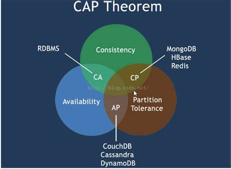

2. 可用性高于一致性场合

   + 发布一张网页到 CDN，多个服务器有这张网页的副本。后来发现一个错误，需要更新网页，这时只能每个服务器都更新一遍。一般来说，网页的更新不是特别强调一致性。短时期内，一些用户拿到老版本，另一些用户拿到新版本，问题不会特别大。当然，所有人最终都会看到新版本。所以，这个场合就是可用性高于一致性。

   

